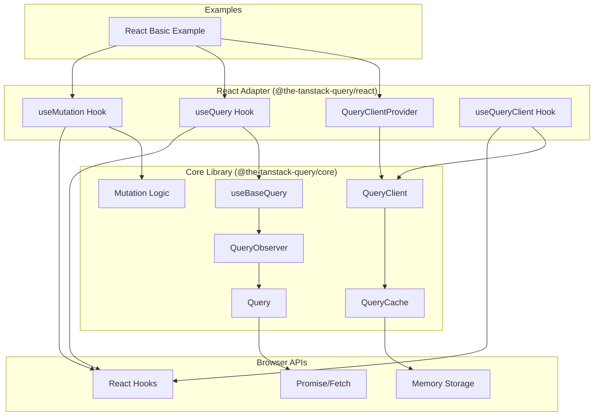
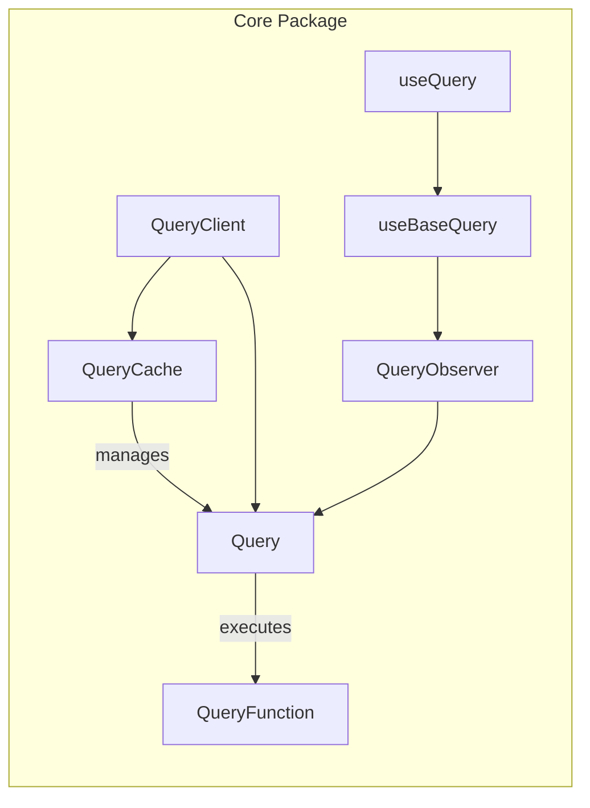
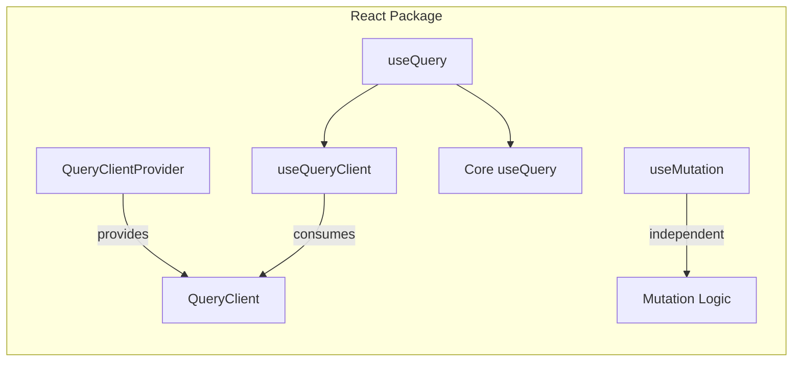
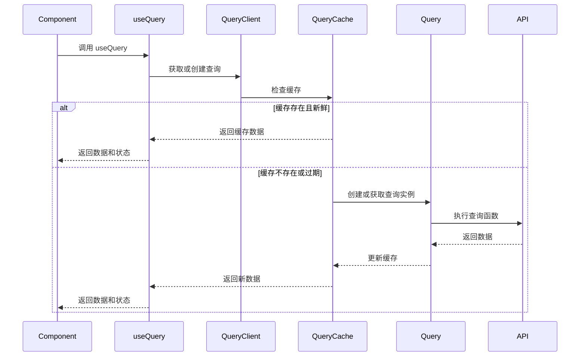
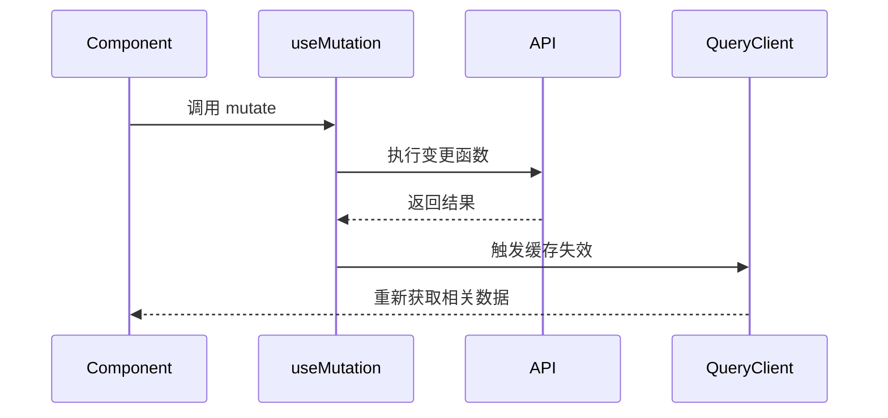
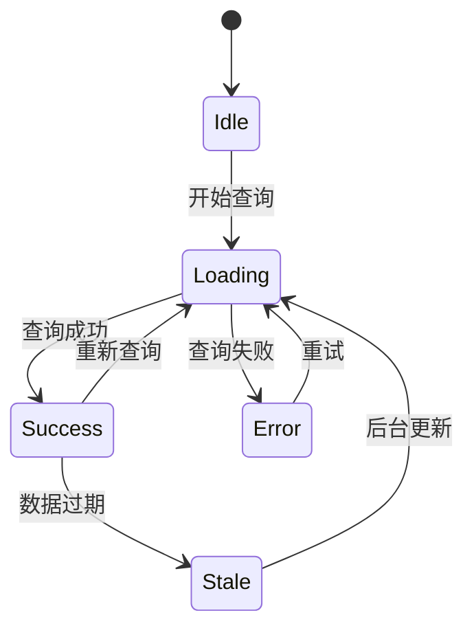
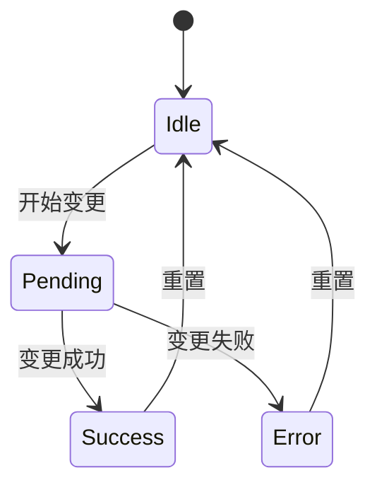
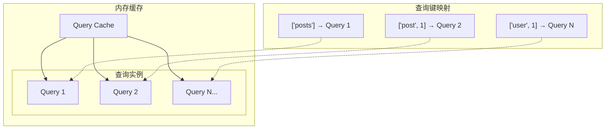
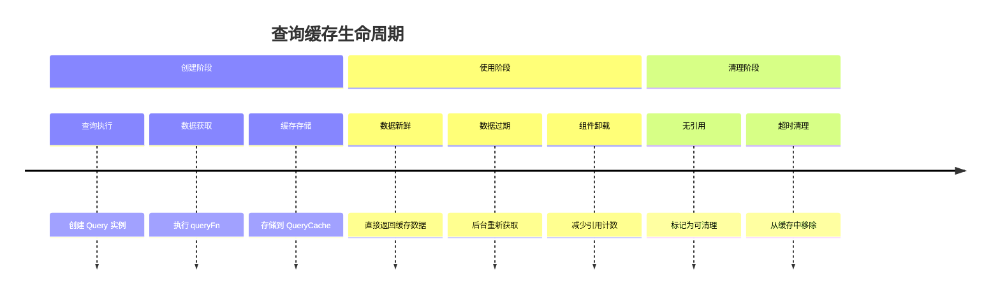

# TanStack Query 项目架构

这个项目实现了一个简化版的 TanStack Query 库，包含核心功能和 React adapter。

## 整体架构

## 包结构

### 核心包 (`packages/core`)

核心包提供了 TanStack Query 的基础功能，不依赖任何 UI 框架。

**主要组件：**

- **QueryClient**: 查询客户端，管理所有查询和缓存
- **QueryCache**: 查询缓存，存储和管理查询实例
- **Query**: 单个查询实例，包含查询状态和数据
- **QueryObserver**: 查询观察者，监听查询状态变化
- **useBaseQuery**: 基础查询 hook，提供查询逻辑

### React 适配器 (`packages/react`)

React 适配器为 React 应用提供了易用的 hooks 和组件。

**主要组件：**

- **QueryClientProvider**: React Context Provider，提供 QueryClient 实例
- **useQueryClient**: 获取 QueryClient 实例的 hook
- **useQuery**: React 版本的查询 hook
- **useMutation**: 数据变更 hook

## 数据流

### 查询数据流

### 变更数据流

## 状态管理

### 查询状态

### 变更状态

## 缓存策略

### 缓存层次

### 缓存生命周期

## 关键设计模式

### 1. 观察者模式
QueryObserver 监听 Query 状态变化，通知 React 组件更新。

### 2. 单例模式
QueryClient 通常作为单例使用，管理全局缓存状态。

### 3. 工厂模式
QueryCache 根据查询键创建和管理 Query 实例。

### 4. 策略模式
不同的缓存策略（staleTime, cacheTime）影响查询行为。

## 扩展点

### 1. 自定义缓存存储
可以扩展缓存存储到 localStorage 或 IndexedDB。

### 2. 中间件系统
添加查询和变更的中间件支持。

### 3. 开发者工具
集成 React DevTools 或独立的调试工具。

### 4. 离线支持
添加网络状态检测和离线缓存功能。

### 5. 其他框架适配器
创建 Vue、Angular 等框架的适配器。

## 性能考虑

### 1. 内存管理
- 自动清理未使用的查询
- 引用计数管理
- 内存泄漏防护

### 2. 网络优化
- 请求去重
- 并发控制
- 智能重试

### 3. 渲染优化
- 最小化重新渲染
- 状态变化批处理
- 组件级别的缓存

这个架构设计确保了代码的可维护性、可扩展性和性能，同时保持了简洁的 API 设计。

