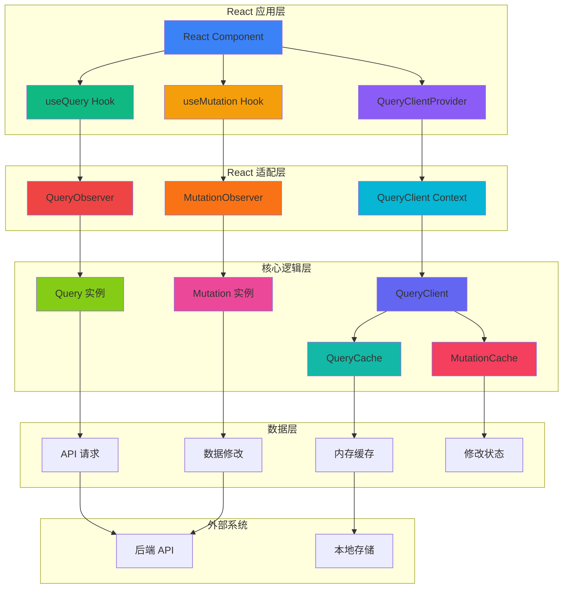
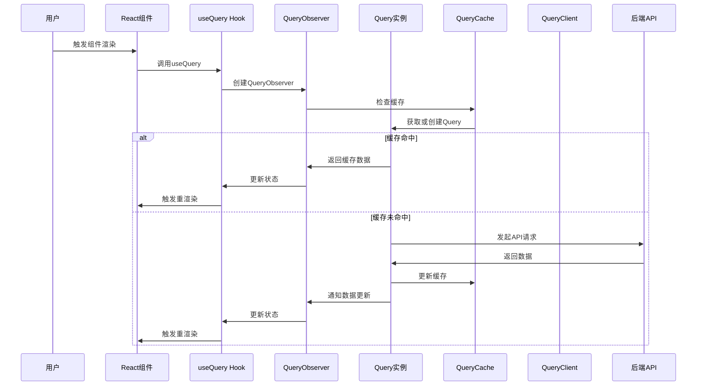

# TanStack Query 手写实现
这是一个 pnpm workspace 项目，用于手写实现 TanStack Query 的核心功能。

## 📊 项目进度概览

**当前完成度：约 25%**

### 学习目标
- 🎯 深入理解 TanStack Query 的核心原理和架构设计
- 🔧 掌握数据获取、缓存、同步、更新等核心功能的实现
- 🏗️ 学习 monorepo 架构和包管理最佳实践
- 🧠 理解观察者模式、状态机、缓存策略等设计模式

### 功能实现状态

| 功能模块 | 状态 | 完成度 | 说明 |
|---------|------|--------|------|
| 📦 **核心包 (core)** | | | |
| └─ QueryClient | ✅ | 100% | 查询客户端基础实现 |
| └─ QueryCache | ⚠️ | 80% | 查询缓存管理系统（缺少hashKey函数）|
| └─ Query 类 | ❌ | 0% | 单个查询状态管理 |
| └─ QueryObserver | ❌ | 0% | 查询观察者模式（文件不存在）|
| └─ useBaseQuery | ⚠️ | 60% | 基础查询Hook（依赖QueryObserver）|
| └─ useQuery | ✅ | 100% | useBaseQuery的简单包装 |
| └─ Mutation | ❌ | 0% | 数据修改功能 |
| └─ 类型定义 | ❌ | 0% | TypeScript类型系统（全部为空）|
| 🎛️ **React包 (react)** | | | |
| └─ QueryClientProvider | ✅ | 100% | Context提供者组件 |
| └─ useQuery Hook | ❌ | 0% | React查询Hook（只有TODO）|
| └─ useMutation Hook | ❌ | 0% | React修改Hook（只有TODO）|
| └─ React类型 | ❌ | 0% | React相关类型定义（只有TODO）|
| 🧪 **示例应用 (apps)** | ❌ | 0% | 测试和演示功能 |

### 🚧 当前阻塞问题

1. **编译错误**: `useBaseQuery.ts` 导入不存在的 `./queryObserver` 文件
2. **运行时错误**: `query-cache.ts` 调用未定义的 `hashKey` 函数
3. **类型错误**: 所有类型文件都是空的，导致 TypeScript 编译失败
4. **核心逻辑缺失**: Query 类是整个系统的核心，但尚未实现
5. **观察者模式缺失**: QueryObserver 文件不存在，无法连接 Query 和 React

## 项目结构

```
the-tanstack-query/
├── packages/
│   ├── core/           # 核心实现包
│   │   └── src/
│   │       ├── index.ts                 # ✅ 导出接口
│   │       ├── query-client.ts          # ✅ QueryClient 实现
│   │       ├── query-cache.ts           # ✅ QueryCache 实现  
│   │       ├── useBaseQuery.ts          # ⚠️  基础查询Hook (有依赖问题)
│   │       ├── useQuery.ts              # ✅ useQuery 包装
│   │       ├── query.ts                 # ❌ Query 类逻辑
│   │       ├── mutation.ts              # ❌ Mutation 逻辑
│   │       └── types.ts                 # ❌ 类型定义
│   └── react/          # React 适配器包
│       └── src/
│           ├── index.ts                      # ✅ 导出接口
│           ├── query-client-provider.tsx     # ✅ Context Provider
│           ├── use-query.ts                  # ❌ React useQuery hook
│           ├── use-mutation.ts               # ❌ React useMutation hook
│           └── types.ts                      # ❌ React 类型
├── apps/               # ❌ 示例应用 (待创建)
├── tools/              # 工具包
└── pnpm-workspace.yaml
```

**图例：**
- ✅ 已完成
- ⚠️ 部分完成（有问题需要修复）
- ❌ 待实现

## 开发命令

```bash
# 安装依赖
pnpm install

# 开发模式（监听文件变化）
pnpm dev

# 构建所有包
pnpm build

# 类型检查
pnpm type-check
```

## 包依赖关系

- `@tanstack-query/react` 依赖 `@tanstack-query/core`
- 使用 `workspace:*` 协议管理内部依赖

## 🚀 详细实现计划

### 阶段一：修复编译问题 (优先级：🔥 高)

#### 1.1 实现 hashKey 工具函数
**文件**: `packages/core/src/utils.ts` (新建)
**目标**: 让 `query-cache.ts` 能正常工作
**实现步骤**:
```typescript
// 将 queryKey 数组转换为字符串 hash
export function hashKey(queryKey: unknown[]): string {
  return JSON.stringify(queryKey)
}
```

#### 1.2 实现基础类型定义
**文件**: `packages/core/src/types.ts`
**目标**: 让 TypeScript 编译通过
**实现步骤**:
```typescript
// 核心类型定义
export type QueryKey = ReadonlyArray<unknown>
export type QueryStatus = 'pending' | 'success' | 'error'
export type QueryState = {
  status: QueryStatus
  data: unknown
  error: Error | null
  isFetching: boolean
}

// Query 相关类型
export interface QueryOptions<TData = unknown, TQueryKey extends QueryKey = QueryKey> {
  queryKey: TQueryKey
  queryFn: () => Promise<TData>
  enabled?: boolean
  staleTime?: number
  cacheTime?: number
}

// Hook 相关类型
export interface UseBaseQueryOptions<TData = unknown, TQueryKey extends QueryKey = QueryKey> {
  queryKey: TQueryKey
  queryFn: () => Promise<TData>
  enabled?: boolean
}

export interface UseBaseQueryResult<TData = unknown, TError = Error> {
  data: TData | undefined
  error: TError | null
  isLoading: boolean
  isError: boolean
  isSuccess: boolean
  refetch: () => void
}
```

#### 1.3 创建 QueryObserver 基础实现
**文件**: `packages/core/src/queryObserver.ts` (新建)
**目标**: 让 `useBaseQuery` 能正常工作
**实现步骤**:
```typescript
// 基础 QueryObserver 实现
export class QueryObserver<TError = Error, TData = unknown, TQueryKey extends QueryKey = QueryKey> {
  constructor(
    private client: QueryClient,
    private options: UseBaseQueryOptions<TData, TQueryKey>
  ) {}

  getOptimisticResult(options: UseBaseQueryOptions<TData, TQueryKey>) {
    // 返回乐观结果
    return {
      data: undefined,
      error: null,
      isLoading: true,
      isError: false,
      isSuccess: false,
      refetch: () => {}
    }
  }

  subscribe(onStoreChange: () => void) {
    // 订阅状态变化
    return () => {} // 返回取消订阅函数
  }

  getCurrentResult() {
    // 获取当前结果
    return this.getOptimisticResult(this.options)
  }

  setOptions(options: UseBaseQueryOptions<TData, TQueryKey>) {
    // 设置新的选项
    this.options = options
  }
}
```

### 阶段二：实现核心 Query 类 (优先级：🔥 高)

#### 2.1 实现 Query 类基础结构
**文件**: `packages/core/src/query.ts`
**目标**: 管理单个查询的状态和生命周期
**实现步骤**:
```typescript
export class Query<TData = unknown, TError = Error> {
  public queryKey: QueryKey
  public queryHash: string
  public state: QueryState
  private cache: QueryCache
  private options: QueryOptions<TData>

  constructor({
    queryKey,
    queryHash,
    options,
    cache
  }: {
    queryKey: QueryKey
    queryHash: string
    options: QueryOptions<TData>
    cache: QueryCache
  }) {
    this.queryKey = queryKey
    this.queryHash = queryHash
    this.options = options
    this.cache = cache
    this.state = {
      status: 'pending',
      data: undefined,
      error: null,
      isFetching: false
    }
  }

  // 执行查询
  async fetch(): Promise<void> {
    if (this.state.isFetching) return
    
    this.state.isFetching = true
    this.state.status = 'pending'
    
    try {
      const data = await this.options.queryFn()
      this.state.data = data
      this.state.status = 'success'
      this.state.error = null
    } catch (error) {
      this.state.error = error as TError
      this.state.status = 'error'
    } finally {
      this.state.isFetching = false
    }
  }
}
```

#### 2.2 完善 QueryCache 集成
**文件**: `packages/core/src/query-cache.ts`
**目标**: 集成 Query 类和 hashKey 函数
**实现步骤**:
```typescript
import { hashKey } from './utils'
import { Query } from './query'

export class QueryCache {
  #queries: Map<string, Query>

  constructor() {
    this.#queries = new Map<string, Query>()
  }

  get(queryHash: string) {
    return this.#queries.get(queryHash)
  }

  add(query: Query): void {
    if (!this.#queries.has(query.queryHash)) {
      this.#queries.set(query.queryHash, query)
    }
  }

  build(options: QueryOptions) {
    const queryKey = options.queryKey
    const queryHash = hashKey(queryKey)
    let query = this.get(queryHash)
    
    if (!query) {
      query = new Query({
        queryKey,
        queryHash,
        options,
        cache: this,
      })
      this.add(query)
    }
    return query
  }
}
```

### 阶段三：完善观察者模式 (优先级：🔥 高)

#### 3.1 完善 QueryObserver 实现
**文件**: `packages/core/src/queryObserver.ts`
**目标**: 连接 Query 和 React 组件
**实现步骤**:
```typescript
export class QueryObserver<TError = Error, TData = unknown, TQueryKey extends QueryKey = QueryKey> {
  private query: Query<TData, TError>
  private listeners: Set<() => void> = new Set()

  constructor(
    private client: QueryClient,
    private options: UseBaseQueryOptions<TData, TQueryKey>
  ) {
    this.query = client.getQueryCache().build(options)
  }

  getOptimisticResult(options: UseBaseQueryOptions<TData, TQueryKey>) {
    return {
      data: this.query.state.data as TData | undefined,
      error: this.query.state.error as TError | null,
      isLoading: this.query.state.status === 'pending',
      isError: this.query.state.status === 'error',
      isSuccess: this.query.state.status === 'success',
      refetch: () => this.query.fetch()
    }
  }

  subscribe(onStoreChange: () => void) {
    this.listeners.add(onStoreChange)
    return () => this.listeners.delete(onStoreChange)
  }

  getCurrentResult() {
    return this.getOptimisticResult(this.options)
  }

  setOptions(options: UseBaseQueryOptions<TData, TQueryKey>) {
    this.options = options
    this.query = this.client.getQueryCache().build(options)
    this.notify()
  }

  private notify() {
    this.listeners.forEach(listener => listener())
  }
}
```

### 阶段四：实现 Mutation 功能 (优先级：🟡 中)

#### 4.1 实现 Mutation 类
**文件**: `packages/core/src/mutation.ts`
**目标**: 处理数据修改操作
**实现步骤**:
```typescript
export class Mutation<TData = unknown, TError = Error, TVariables = unknown> {
  public state: {
    status: 'idle' | 'pending' | 'success' | 'error'
    data: TData | undefined
    error: TError | null
    isPending: boolean
    isSuccess: boolean
    isError: boolean
  }

  constructor(
    private options: {
      mutationFn: (variables: TVariables) => Promise<TData>
      onSuccess?: (data: TData) => void
      onError?: (error: TError) => void
    }
  ) {
    this.state = {
      status: 'idle',
      data: undefined,
      error: null,
      isPending: false,
      isSuccess: false,
      isError: false
    }
  }

  async mutate(variables: TVariables): Promise<TData> {
    this.state.status = 'pending'
    this.state.isPending = true
    this.state.error = null

    try {
      const data = await this.options.mutationFn(variables)
      this.state.data = data
      this.state.status = 'success'
      this.state.isSuccess = true
      this.options.onSuccess?.(data)
      return data
    } catch (error) {
      this.state.error = error as TError
      this.state.status = 'error'
      this.state.isError = true
      this.options.onError?.(error as TError)
      throw error
    } finally {
      this.state.isPending = false
    }
  }
}
```

### 阶段五：完善 React 集成 (优先级：🟡 中)

#### 5.1 实现 React useQuery Hook
**文件**: `packages/react/src/use-query.ts`
**目标**: 提供 React 组件使用的查询 Hook
**实现步骤**:
```typescript
import { useBaseQuery } from '@the-tanstack-query/core'

export function useQuery<TData = unknown, TError = Error, TQueryKey extends QueryKey = QueryKey>(
  options: UseQueryOptions<TData, TQueryKey>
): UseQueryResult<TData, TError> {
  return useBaseQuery(options)
}
```

#### 5.2 实现 React useMutation Hook
**文件**: `packages/react/src/use-mutation.ts`
**目标**: 提供 React 组件使用的修改 Hook
**实现步骤**:
```typescript
import { useState, useCallback } from 'react'
import { Mutation } from '@the-tanstack-query/core'

export function useMutation<TData = unknown, TError = Error, TVariables = unknown>(
  options: {
    mutationFn: (variables: TVariables) => Promise<TData>
    onSuccess?: (data: TData) => void
    onError?: (error: TError) => void
  }
) {
  const [mutation] = useState(() => new Mutation(options))

  const mutate = useCallback((variables: TVariables) => {
    return mutation.mutate(variables)
  }, [mutation])

  return {
    mutate,
    ...mutation.state
  }
}
```

### 阶段六：创建示例应用 (优先级：🟢 低)

#### 6.1 创建基础 React 应用
**文件**: `apps/example/` (新建目录)
**目标**: 演示和测试功能
**实现步骤**:
```typescript
// 创建基础的 React 应用
// 演示 useQuery 和 useMutation 的使用
// 包含错误处理和加载状态
```

#### 6.2 添加测试用例
**目标**: 确保功能正确性
**实现步骤**:
```typescript
// 为每个核心类添加单元测试
// 测试查询、缓存、观察者模式等功能
```

### 阶段七：优化和文档 (优先级：🟢 低)

#### 7.1 性能优化
- 实现查询去重
- 添加缓存策略
- 优化重渲染

#### 7.2 完善文档
- API 文档
- 使用示例
- 最佳实践指南

## 🏗️ 架构设计思路

### 核心概念
- **QueryClient**: 查询客户端，管理整个查询系统的入口
- **QueryCache**: 查询缓存，存储和管理所有查询结果
- **Query**: 单个查询实例，管理特定查询的状态和生命周期
- **QueryObserver**: 观察者模式，连接查询和 React 组件
- **Hooks**: React 集成层，提供 `useQuery`、`useMutation` 等 API

### 系统架构图



### 数据流向详解



### 🎓 学习路径图

```mermaid
graph LR
    subgraph "第一阶段：基础概念"
        A1[理解数据获取问题] --> A2[学习缓存概念]
        A2 --> A3[了解状态管理]
    end
    
    subgraph "第二阶段：核心架构"
        B1[QueryClient设计] --> B2[QueryCache实现]
        B2 --> B3[Query类设计]
        B3 --> B4[观察者模式]
    end
    
    subgraph "第三阶段：React集成"
        C1[Context API] --> C2[Custom Hooks]
        C2 --> C3[状态同步]
        C3 --> C4[性能优化]
    end
    
    subgraph "第四阶段：高级特性"
        D1[乐观更新] --> D2[错误处理]
        D2 --> D3[重试机制]
        D3 --> D4[缓存策略]
    end
    
    A3 --> B1
    B4 --> C1
    C4 --> D1
    
    style A1 fill:#dbeafe
    style A2 fill:#dbeafe
    style A3 fill:#dbeafe
    style B1 fill:#d1fae5
    style B2 fill:#d1fae5
    style B3 fill:#d1fae5
    style B4 fill:#d1fae5
    style C1 fill:#fef3c7
    style C2 fill:#fef3c7
    style C3 fill:#fef3c7
    style C4 fill:#fef3c7
    style D1 fill:#fce7f3
    style D2 fill:#fce7f3
    style D3 fill:#fce7f3
    style D4 fill:#fce7f3
```



### 🔍 各部分关系详解

#### 1. **QueryClient** - 系统入口
- **职责**: 管理整个查询系统，提供全局配置
- **关系**: 被所有其他组件依赖，是系统的"大脑"
- **学习重点**: 单例模式、配置管理、生命周期管理

#### 2. **QueryCache** - 数据存储中心
- **职责**: 存储所有查询结果，管理缓存策略
- **关系**: 被QueryClient管理，为Query提供数据存储
- **学习重点**: Map数据结构、缓存策略、内存管理

#### 3. **Query** - 单个查询的生命周期
- **职责**: 管理单个查询的状态、数据、错误等
- **关系**: 被QueryCache管理，被QueryObserver观察
- **学习重点**: 状态机、Promise处理、错误处理

#### 4. **QueryObserver** - 连接器
- **职责**: 连接Query和React组件，处理状态同步
- **关系**: 观察Query变化，通知React组件更新
- **学习重点**: 观察者模式、事件系统、状态同步

#### 5. **React Hooks** - 用户接口
- **职责**: 为React组件提供简单的API
- **关系**: 内部使用QueryObserver，对外提供简洁接口
- **学习重点**: Custom Hooks、React状态管理、性能优化

### 📚 具体学习建议

#### **从简单到复杂的学习顺序：**

1. **先理解问题** (1-2天)
   - 为什么需要React Query？
   - 传统数据获取有什么问题？
   - 缓存能解决什么问题？

2. **学习核心概念** (3-5天)
   - 从QueryClient开始，理解系统入口
   - 学习QueryCache，理解数据存储
   - 实现Query类，理解单个查询管理

3. **实现观察者模式** (2-3天)
   - 理解发布-订阅模式
   - 实现QueryObserver
   - 连接Query和React

4. **React集成** (2-3天)
   - 实现Context Provider
   - 创建Custom Hooks
   - 处理组件生命周期

5. **高级特性** (3-5天)
   - 错误处理和重试
   - 乐观更新
   - 缓存策略优化

## 📋 实现检查清单

### 阶段一：修复编译问题
- [ ] 1.1 创建 `packages/core/src/utils.ts` 并实现 `hashKey` 函数
- [ ] 1.2 实现 `packages/core/src/types.ts` 中的基础类型定义
- [ ] 1.3 创建 `packages/core/src/queryObserver.ts` 基础实现
- [ ] 1.4 修复 `packages/core/src/query-cache.ts` 中的导入问题
- [ ] 1.5 修复 `packages/core/src/useBaseQuery.ts` 中的导入问题
- [ ] 1.6 确保项目能够正常编译

### 阶段二：实现核心 Query 类
- [ ] 2.1 实现 `packages/core/src/query.ts` 中的 Query 类
- [ ] 2.2 完善 Query 类的状态管理
- [ ] 2.3 实现查询生命周期管理
- [ ] 2.4 添加错误处理和重试逻辑
- [ ] 2.5 更新 `packages/core/src/query-cache.ts` 集成 Query 类

### 阶段三：完善观察者模式
- [ ] 3.1 完善 `packages/core/src/queryObserver.ts` 实现
- [ ] 3.2 实现状态变更通知机制
- [ ] 3.3 连接 Query 和 React 组件
- [ ] 3.4 测试观察者模式功能

### 阶段四：实现 Mutation 功能
- [ ] 4.1 实现 `packages/core/src/mutation.ts` 中的 Mutation 类
- [ ] 4.2 添加数据修改操作
- [ ] 4.3 实现乐观更新
- [ ] 4.4 添加缓存失效策略

### 阶段五：完善 React 集成
- [ ] 5.1 实现 `packages/react/src/use-query.ts`
- [ ] 5.2 实现 `packages/react/src/use-mutation.ts`
- [ ] 5.3 完善 `packages/react/src/types.ts`
- [ ] 5.4 测试 React Hooks 功能

### 阶段六：创建示例应用
- [ ] 6.1 创建 `apps/example/` 目录结构
- [ ] 6.2 实现基础 React 应用
- [ ] 6.3 演示 useQuery 功能
- [ ] 6.4 演示 useMutation 功能
- [ ] 6.5 添加错误处理和加载状态

### 阶段七：优化和文档
- [ ] 7.1 实现查询去重
- [ ] 7.2 添加缓存策略
- [ ] 7.3 优化重渲染性能
- [ ] 7.4 编写 API 文档
- [ ] 7.5 添加使用示例

## 🎓 学习路径建议

### 第一步：理解问题 (1-2天)
1. **为什么需要 TanStack Query？**
   - 传统数据获取的问题：重复请求、状态管理复杂、缓存困难
   - 理解数据获取的复杂性：loading、error、success 状态管理

2. **核心概念理解**
   - 查询键 (QueryKey)：如何唯一标识一个查询
   - 查询函数 (QueryFn)：如何获取数据
   - 缓存策略：何时使用缓存，何时重新请求

### 第二步：实现基础架构 (3-5天)
1. **从 QueryClient 开始**
   - 理解单例模式
   - 学习配置管理
   - 实现生命周期管理

2. **实现 QueryCache**
   - 学习 Map 数据结构
   - 理解缓存策略
   - 实现内存管理

3. **实现 Query 类**
   - 学习状态机设计
   - 理解 Promise 处理
   - 实现错误处理

### 第三步：实现观察者模式 (2-3天)
1. **理解发布-订阅模式**
   - 学习观察者模式
   - 理解事件系统
   - 实现状态同步

2. **实现 QueryObserver**
   - 连接 Query 和 React
   - 处理组件生命周期
   - 实现状态变更通知

### 第四步：React 集成 (2-3天)
1. **实现 Context Provider**
   - 学习 React Context API
   - 理解依赖注入
   - 实现全局状态管理

2. **创建 Custom Hooks**
   - 学习 Hook 设计模式
   - 理解状态管理
   - 实现性能优化

### 第五步：高级特性 (3-5天)
1. **错误处理和重试**
   - 实现错误边界
   - 添加重试机制
   - 处理网络错误

2. **乐观更新**
   - 理解乐观更新概念
   - 实现数据预更新
   - 处理更新失败回滚

3. **缓存策略优化**
   - 实现智能缓存
   - 添加过期策略
   - 优化内存使用

## 🎯 当前项目中的学习重点

基于你们已经完成的部分，建议接下来：

1. **立即修复** `hashKey` 函数缺失问题
2. **实现基础类型定义**，让项目能编译
3. **从Query类开始**，这是理解整个系统的关键
4. **逐步实现QueryObserver**，理解观察者模式

这样的学习路径能让你从底层开始理解，而不是只知其然不知其所以然！

## 🚀 快速开始

如果你想立即开始实现，建议按以下顺序：

1. **第一步**：修复编译问题
   ```bash
   # 创建 utils.ts 文件
   # 实现 hashKey 函数
   # 实现基础类型定义
   ```

2. **第二步**：实现 Query 类
   ```bash
   # 实现 query.ts 中的 Query 类
   # 测试基础查询功能
   ```

3. **第三步**：实现 QueryObserver
   ```bash
   # 创建 queryObserver.ts 文件
   # 实现观察者模式
   # 连接 Query 和 React
   ```

每一步都有详细的代码示例和实现指导，确保你能顺利完成整个项目！ 